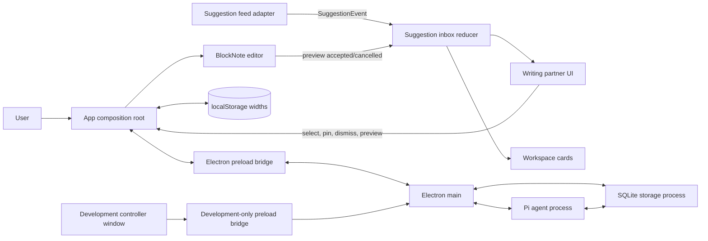
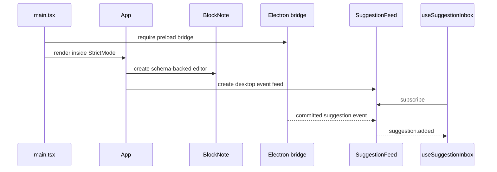

# Architecture

## System boundary

The React renderer has one application composition: Electron supplies a required preload bridge, main-process orchestration, a SQLite utility process, and a Pi utility process. Vite serves that renderer inside Electron during development and builds it for `file://` loading in production. There is still no routing library.



The `SuggestionFeed` remains transport-neutral, while its only application adapter maps committed Electron events. Desktop queries and commands use the typed `DesktopBridge` contract. Development injection is a separately gated bridge and enters the same persisted storage/event path.

## Composition root

[`App.tsx`](../src/App.tsx) creates and connects long-lived objects:

1. `useCreateBlockNote` creates the editor from `writingSchema` and seeded content.
2. `createDesktopSuggestionFeed` creates the Electron event adapter and is memoized for the component lifetime.
3. `useSuggestionInbox` subscribes to the feed and owns the suggestion lifecycle reducer.
4. `App` creates editor preview blocks, translates preview resolution events back into inbox actions, and controls responsive panels.

Keeping feed creation stable is important. Recreating it during a render would resubscribe the inbox to desktop events.

## State ownership

| State | Owner | Lifetime / persistence |
| --- | --- | --- |
| Editor blocks and selection | BlockNote editor created in `App` | Selection is in-memory; accepted blocks autosave in Electron |
| Feed subscribers | `createDesktopSuggestionFeed` closure | Renderer lifetime |
| Inbox, pins, preview id, agent status, errors | `useSuggestionInbox` / `inboxReducer` | Visible suggestion projection persists in Electron; preview/status stay ephemeral |
| Workspace pin geometry and z-order | Inbox reducer | Persists in Electron |
| Desktop panel open/closed state | `App` React state | Current page only |
| Mobile drawer open/closed state | `App` React state | Current page only |
| Last editor block with a text cursor | `App` React state | Current page only |
| Desktop column widths | `App` React state | `localStorage` when available |
| Documents, sources, transcripts, memory | SQLite storage process | Electron application data |
| Agent model configuration | Electron main | `agent.yaml` in Electron application data; credentials resolve from the environment |
| Draft title, tab, source, and navigation data | Component constants | Static |

There is intentionally one owner for each lifecycle. Components such as `SuggestionDock`, `WorkspacePins`, and `DocumentHeader` receive values and callbacks; they do not own duplicate application state.

## Module boundaries

### `src/editor`

- [`schema.tsx`](../src/editor/schema.tsx) extends BlockNote with the `suggestionPreview` block and implements accept/cancel behavior.
- [`previewEvents.ts`](../src/editor/previewEvents.ts) is a small in-process event bridge from the custom block renderer back to `App`.

The editor layer knows suggestion IDs, but it does not import or mutate inbox state.

### `src/suggestions`

- [`types.ts`](../src/suggestions/types.ts) defines suggestion data and the feed interface.
- [`validation.ts`](../src/suggestions/validation.ts) validates suggestion payloads at runtime before development IPC reaches storage.
- [`inbox.ts`](../src/suggestions/inbox.ts) implements all suggestion, pin, preview, and workspace transitions.
- [`workspacePinLayout.ts`](../src/suggestions/workspacePinLayout.ts) supplies type-specific initial card sizes.

### `src/dev/mockSuggestions`

This temporary directory owns the Electron-only controller view and payload builder. Main and preload expose its injection bridge only during Vite development; storage persists accepted mock suggestions exactly like agent-created suggestions.

This layer is React-independent except for the `useSuggestionInbox` hook at the bottom of `inbox.ts`. The reducer itself is a pure function and is the most important unit-test boundary.

### `desktop` and `src/desktop`

- `desktop/main.ts` owns Electron lifecycle, renderer IPC, utility processes, and the 10-second scheduler.
- `desktop/storage.ts` owns schema creation, SQLite queries, source extraction, committed events, and agent persistence.
- `desktop/agent.ts` embeds Pi agent-core, defines domain tools, records transcripts, and coalesces observations.
- `desktop/preload.ts` exposes the typed desktop API.
- `src/desktop/desktopClient.ts` maps desktop events into `SuggestionFeed`.
- `src/shared/desktop.ts` is the cross-process contract.

### `src/components`

- [`EditorWorkspace.tsx`](../src/components/EditorWorkspace.tsx) joins the document header and editor surface.
- [`DocumentEditor.tsx`](../src/components/DocumentEditor.tsx) renders BlockNote and calculates initial workspace-card placement.
- [`SuggestionDock.tsx`](../src/components/SuggestionDock.tsx) renders the inbox, pinned section, detail view, and errors.
- [`WorkspacePins.tsx`](../src/components/WorkspacePins.tsx) renders desktop cards and handles bounded pointer/keyboard geometry.
- [`DocumentHeader.tsx`](../src/components/DocumentHeader.tsx) exposes responsive panel controls and document action placeholders.
- [`ResponsiveDrawer.tsx`](../src/components/ResponsiveDrawer.tsx) provides the below-desktop modal panel behavior.
- [`ColumnResizeHandle.tsx`](../src/components/ColumnResizeHandle.tsx) provides pointer and keyboard column resizing.
- [`SuggestionPresentation.tsx`](../src/components/SuggestionPresentation.tsx) renders kind badges and structured suggestion visuals.
- [`MermaidDiagram.tsx`](../src/components/MermaidDiagram.tsx) lazy-loads Mermaid and renders an accessible fallback on failure.
- [`Sidebar.tsx`](../src/components/Sidebar.tsx) renders the static project navigation shell plus the persisted Electron source list and upload callback.

Components rely on their props for application actions. When adding behavior, prefer moving data and transitions into the relevant owner rather than making a display component stateful.

## Renderer bootstrap sequence

The renderer refuses to construct `App` without the Electron bridge. The complete process startup is documented separately in [Desktop persistence and Pi runtime](desktop-runtime.md#startup-and-renderer-loading).



## Data direction and dependency rules

The intended dependency direction is:

```text
types/contracts
    ↑
editor utilities     suggestion implementations
    ↑                         ↑
components  ← props/callbacks → App composition root
```

Practical rules:

- Domain contracts belong in `suggestions/types.ts`, not in UI components.
- Suggestion lifecycle changes belong in the reducer and should have reducer tests.
- Transport or model SDK code should sit behind `SuggestionFeed`.
- Cross-feature orchestration is acceptable in `App.tsx`; lower-level components should not import the composition root or one another's state.
- CSS layout variables are set by `App` but interpreted by `index.css`.

## Styling architecture

Tailwind CSS 4 is loaded through the Vite plugin and `@import "tailwindcss"` in [`index.css`](../src/index.css). Most component styling is inline utility classes. The global stylesheet is reserved for:

- theme tokens and brand colors;
- base focus and typography rules;
- the responsive three-column grid;
- BlockNote variable and content overrides;
- the custom suggestion-preview block;
- Mermaid SVG sizing.

BlockNote's shadcn stylesheet is imported by `DocumentEditor.tsx`. Its utility classes are made visible to Tailwind's scanner with `@source "../node_modules/@blocknote/shadcn"`.

## Build and runtime assumptions

- TypeScript is strict and emits no files during type-checking.
- Vite targets a browser application; there is no server-side rendering guard around browser globals.
- Vite's `base` is `./` because the production renderer is loaded from `file://`; changing it back to `/` breaks all built renderer assets in Electron.
- Electron main, storage, and agent bundles are ES modules. Main must finish evaluating before Electron can become ready, so application startup is registered as a promise continuation rather than awaited at module scope.
- Mermaid is a dynamic chunk because `MermaidDiagram` imports it lazily.
- Google Fonts are external runtime requests. Font failure degrades to local fallbacks.
- `dist/`, `dist-electron/`, and `release/` are generated outputs; source code lives under `src/` and `desktop/`.
- Files in `artifacts/` are not imported and have no runtime effect.

## Architectural invariants

Changes should preserve these unless the design is deliberately revised and documented:

1. Only one editable suggestion preview can exist at a time.
2. Preview content is user-owned once inserted; feed updates never overwrite it.
3. Pinned suggestions are frozen snapshots and ignore later feed updates or retractions.
4. The live inbox holds at most 30 entries; pinned and workspace entries do not count toward that limit.
5. Selected and previewed entries are protected from queue eviction.
6. Desktop panel state and mobile drawer state are separate.
7. Workspace geometry is clamped to the current editor canvas.
