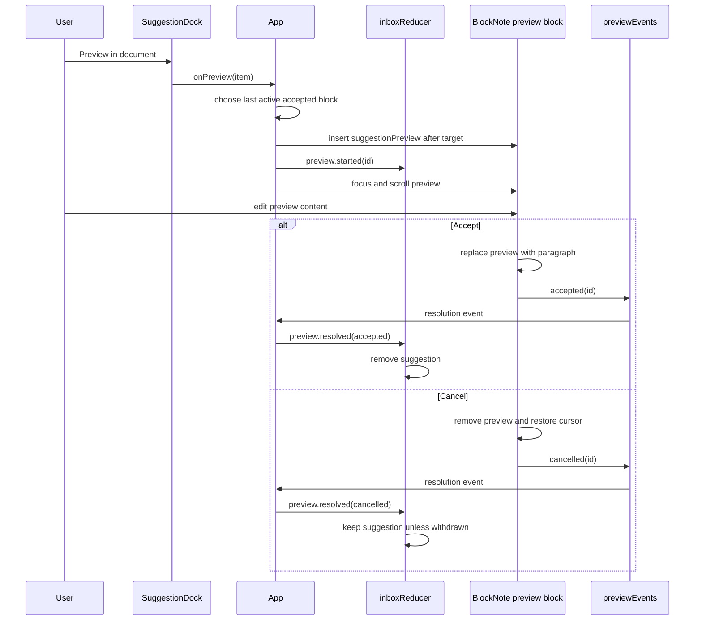
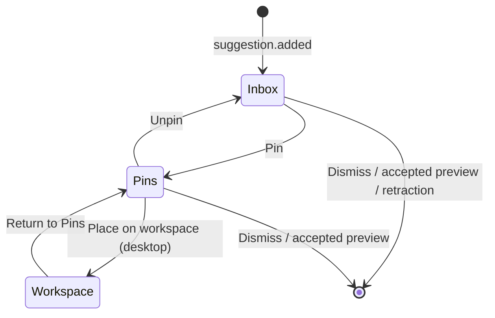

# Editor and suggestion system

This is the core interaction model: the Electron feed emits committed events, the inbox reducer turns those events and user actions into state, and text suggestions can temporarily enter the document as editable previews.

## Domain model

The shared contracts are in [`src/suggestions/types.ts`](../src/suggestions/types.ts).

### Suggestion kinds

| Kind | Type | Extra data | Can preview into document? | Visual treatment |
| --- | --- | --- | --- | --- |
| `snippet` | `TextSuggestion` | `insertText` | Yes | Text detail |
| `fact` | `TextSuggestion` | `insertText` | Yes | Text detail |
| `term` | `TextSuggestion` | `insertText` | Yes | Text detail |
| `outline` | `StructureSuggestion` | recursive `nodes` | No | Nested structure cards |
| `layout` | `StructureSuggestion` | recursive `nodes` | No | Nested structure cards |
| `mindMap` | `MindMapSuggestion` | Mermaid source and accessible description | No | Lazy-rendered Mermaid diagram |

Every suggestion also carries:

- `id`: identity for updates, retractions, selection, and actions;
- `dedupeKey`: session-level duplicate prevention for additions;
- `title`, `summary`, and `body`: progressively more detailed presentation text;
- `sourceLabels`: display-only attribution labels;
- `createdAt`: ordering and queue-eviction input.

An update uses `id` to replace an existing live item. An addition uses `dedupeKey` to decide whether the session has already seen equivalent content. These fields are related but not interchangeable.

## Feed contract

`SuggestionFeed` is subscription-only:

```ts
interface SuggestionFeed {
  subscribe(listener: (event: SuggestionEvent) => void): () => void;
}
```

The event channel supports:

| Event | Meaning |
| --- | --- |
| `suggestion.added` | Introduce a suggestion if its `dedupeKey` has not been seen. |
| `suggestion.updated` | Replace a live suggestion with the same `id`. |
| `suggestion.retracted` | Remove a live suggestion, unless user state protects it. |
| `agent.status` | Set `idle`, `working`, or `offline` and clear the current error. |
| `agent.error` | Set a displayable error and its recoverability metadata. |

The renderer uses [`createDesktopSuggestionFeed`](../src/desktop/desktopClient.ts). It receives suggestion and agent-status events from Electron main. Suggestions are written to the desktop database before an event is forwarded, so reload hydrates the same inbox projection.

During Vite development, a separate Electron controller window supports all six suggestion kinds. It generates identity, dedupe, and timestamp fields, validates recursive structure-node JSON, and invokes a development-only preload bridge. Main validates the payload again and asks storage to commit it through the same suggestion path used by the Pi agent.

## Inbox state machine

[`inboxReducer`](../src/suggestions/inbox.ts) owns:

```text
entries             live inbox suggestions
pinnedEntries       frozen references in the Pins section
workspacePins       frozen references placed over the editor
seenKeys            dedupe keys accepted during this page session
selectedId          item shown in detail view
activePreviewId     the one suggestion currently previewed in BlockNote
nextZIndex          monotonic stacking counter for workspace cards
status / error      agent presentation state
```

### Feed-event behavior

| Situation | Reducer behavior |
| --- | --- |
| Add with a new `dedupeKey` | Append an unread live entry, then enforce the 30-entry limit. |
| Add with a seen `dedupeKey` | Ignore it, even if the earlier entry was dismissed or evicted. |
| Update a normal live item | Replace the item. |
| Update the active preview's live item | Replace the inbox item and mark it stale; the editor preview is untouched. |
| Update a pinned or workspace item | No change to that frozen copy. |
| Retract a normal live item | Remove it. |
| Retract a selected or previewed live item | Keep it and mark it withdrawn and stale. |
| Retract a pinned or workspace item | Ignore the retraction. |
| Agent status | Set status and clear error. |
| Agent error | Store the error and return status to idle. |

### Queue limit

The live queue is limited to 30. Pins and workspace cards do not count. If eviction is necessary:

1. the selected item and active preview are protected;
2. viewed items are evicted before unread items;
3. within that group, the oldest `createdAt` value is evicted first.

The UI sorts the remaining live entries differently for display: unread first, then newest first. Pinned entries display most recently pinned first.

### User-action behavior

- Selecting marks the item viewed and opens detail.
- Back clears detail and removes withdrawn entries unless one still owns the active preview.
- Dismiss removes an inbox or pinned item and closes its detail view. Dismiss is disabled while that item has the active preview.
- Pin removes a live item and stores a deep copy with `pinnedAt`. This freezes the content.
- Unpin moves the frozen item back to the live queue and reapplies the queue limit.
- Place on workspace moves a pinned item to the canvas, unless it owns the active preview.
- Return to Pins removes the workspace card and creates a viewed pinned entry.
- Raising a card assigns a new monotonic z-index only if it is not already highest.

The deep copy currently uses JSON serialization. Suggestion data must therefore remain JSON-safe unless `copySuggestion` is replaced with a different immutable-copy strategy.

## Editable preview lifecycle

Only `snippet`, `fact`, and `term` suggestions expose “Preview in document.” The orchestration is split between `App`, the custom BlockNote block, and the inbox reducer.



### Preview insertion

`App.handlePreview` rejects the request when:

- another preview is active;
- the suggestion is not a text suggestion;
- there is no accepted reference block.

It finds the most recently selected text block among accepted blocks. If that block no longer exists, it falls back to the final accepted top-level block. The preview is inserted immediately after that block with:

- `suggestionId`, for resolving inbox state;
- `targetBlockId`, for cursor restoration on cancellation;
- editable inline content initialized from `insertText`.

The inserted block receives focus and is scrolled toward the center of the viewport.

### Preview rendering and resolution

[`schema.tsx`](../src/editor/schema.tsx) registers `suggestionPreview` alongside BlockNote's default blocks. Its React renderer owns the buttons:

- Accept is disabled if recursive content inspection finds no visible text.
- Accept replaces the custom block with a normal paragraph carrying the edited inline content.
- Cancel removes the block and tries to return the cursor to `targetBlockId`, falling back to the final document block.
- Both outcomes emit an in-process resolution event.

The preview's `toExternalHTML` returns an empty span, so preview content is not intended for exported HTML. There is no export implementation yet, but this protects future default serialization from treating a temporary proposal as accepted text.

### Concurrent feed changes

The preview is a snapshot. If the feed updates the source suggestion, the detail view reports that the item was refined, but the user's editable block is never rewritten. If the feed retracts it, the detail view reports withdrawal and the preview remains resolvable. Cancelling a withdrawn preview removes the suggestion; accepting any preview removes it.

## Pins and workspace cards

Pins are a separate lifecycle from previews:



When a card is placed, the reducer marks it `pendingInitialPlacement`. On the next animation frame, [`DocumentEditor`](../src/components/DocumentEditor.tsx) calculates a visible position based on:

- suggestion-kind default size;
- current canvas width and height;
- current scroll viewport;
- a five-position, 24 px cascade.

It then commits the geometry, clearing the pending flag. [`WorkspacePins`](../src/components/WorkspacePins.tsx) renders only committed cards and clamps them whenever the canvas changes size.

Initial sizes are:

| Content | Width | Height |
| --- | ---: | ---: |
| Text suggestion | 320 px | 240 px |
| Outline or layout | 380 px | 300 px |
| Mind map | 460 px | 340 px |

Cards cannot be smaller than 280 × 180 px and keep 16 px of edge padding. Geometry and z-order are included in the persisted suggestion projection and restored on reload.

## Mermaid rendering

Mind maps use [`MermaidDiagram`](../src/components/MermaidDiagram.tsx):

- the `mermaid` package is imported once, lazily;
- the singleton is initialized with `securityLevel: "strict"` and `startOnLoad: false`;
- React IDs are sanitized into per-render Mermaid IDs;
- the rendered SVG is injected into a `role="img"` container with a combined title and accessible description;
- errors render the description as a visible fallback;
- the effect ignores late async results after unmount.

Because SVG injection is deliberate, keep Mermaid in strict mode and treat source strings as untrusted when replacing the injected feed.
